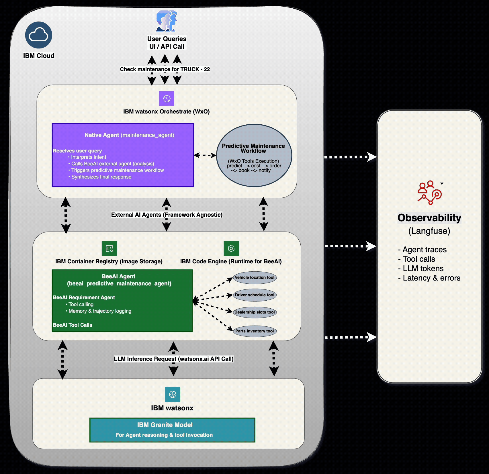
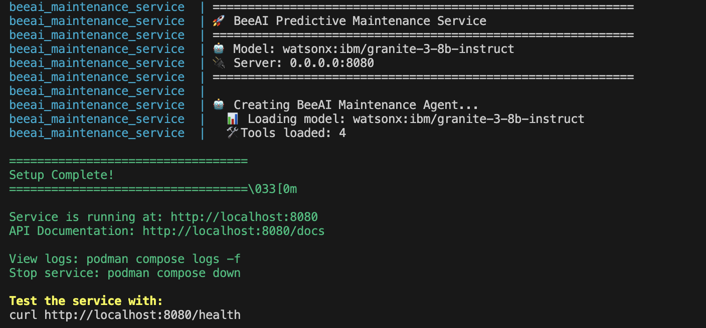
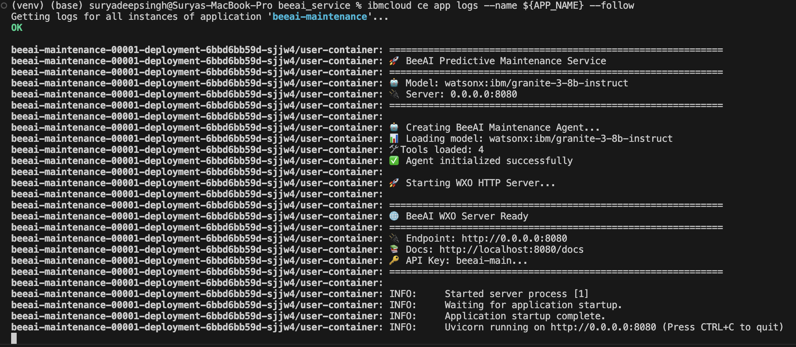
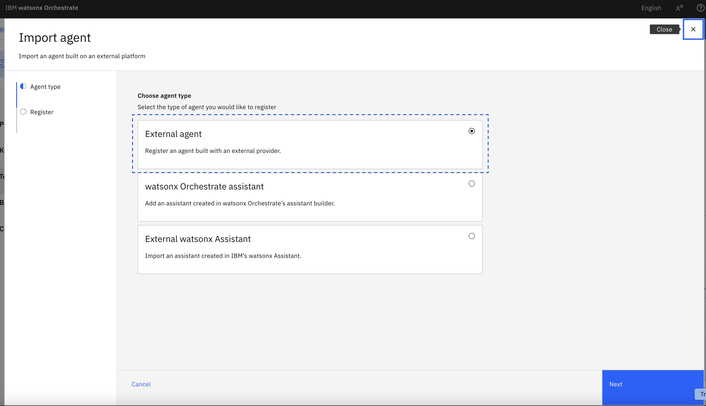
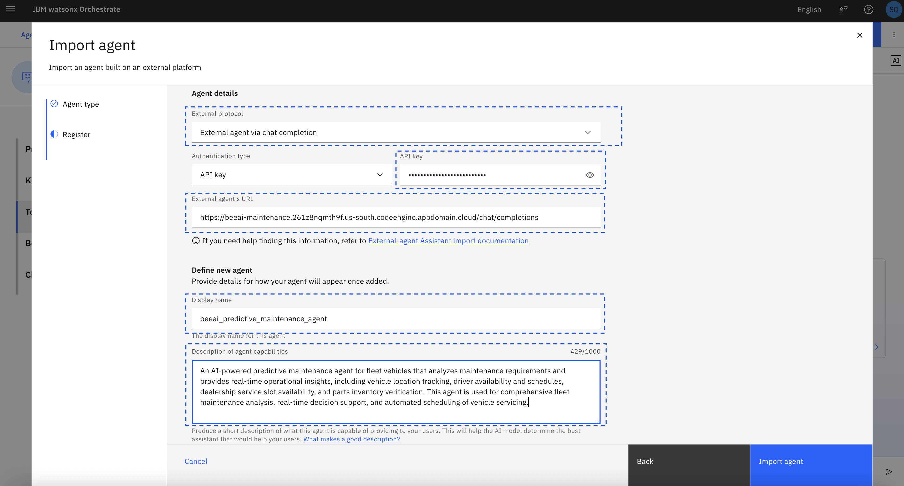
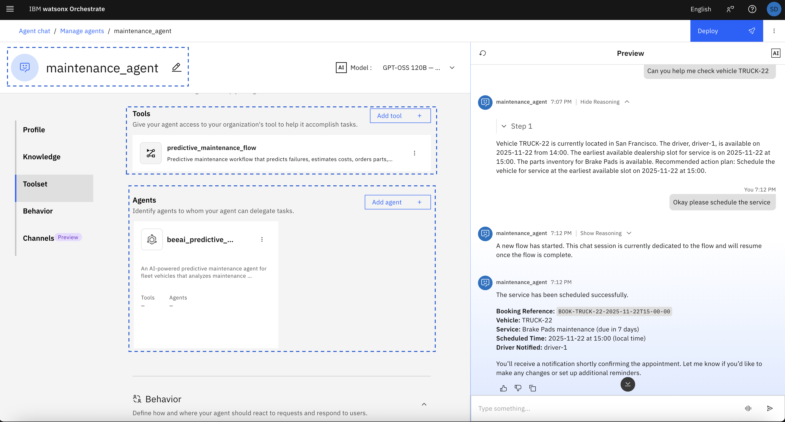
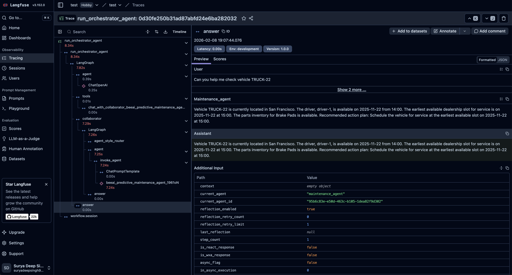

# 🚗 Predictive Maintenance Automation

**Enterprise AI Integration Demo: BeeAI + IBM watsonx.ai (Granite) + Watsonx Orchestrate + Langfuse**

[](https://www.ibm.com/watsonx)
[](https://github.com/i-am-bee/bee-agent-framework)
[](https://www.ibm.com/granite)
[](https://www.ibm.com/watsonx/orchestrate)

---

## 📋 Table of Contents

- [Overview](#-overview)
- [System Architecture](#-system-architecture)
- [Key Features](#-key-features)
- [Prerequisites](#-prerequisites)
- [Project Structure](#-project-structure)
- [Local Setup](#-local-setup)
- [IBM Code Engine Deployment](#-ibm-code-engine-deployment)
- [Watsonx Orchestrate Integration](#-watsonx-orchestrate-integration)
- [Observability with Langfuse](#-observability-with-langfuse)
- [Testing](#-testing)
- [API Reference](#-api-reference)

---

## 🎯 Overview

This project demonstrates a **production-ready AI agent integration** for predictive vehicle maintenance, combining five enterprise technologies:

| Technology | Role |
|------------|------|
| **🤖 BeeAI Framework** | Agentic AI with tool orchestration |
| **🧠 IBM watsonx.ai** | Enterprise LLM platform and infrastructure |
| **💎 Granite 3.8B** | High-performance instruction-following model |
| **🔗 Watsonx Orchestrate** | Workflow automation and agent management |
| **📊 Langfuse** | End-to-end AI observability and tracing |

### What This System Does

- ✅ **Predicts** vehicle component failures before they happen
- ✅ **Analyzes** real-time data: vehicle location, driver availability, service slots, parts inventory
- ✅ **Orchestrates** end-to-end workflows: predict → estimate cost → order parts → book service → notify driver
- ✅ **Integrates** WXO native agents with external BeeAI agent over HTTP
- ✅ **Traces** every agent decision, tool call, and LLM interaction

---

## 🏗️ System Architecture



### Data Flow

```
User Query: "Check maintenance for TRUCK-22"
    ↓
Watsonx Orchestrate (maintenance_agent)
    ├─→ Calls: BeeAI external agent (HTTP POST /chat/completions)
    │     ↓
    │   BeeAI Service (FastAPI)
    │     ├─→ Tool 1: get_vehicle_location("TRUCK-22") → San Francisco
    │     ├─→ Tool 2: get_driver_schedule("driver-1") → Available 2025-11-22 14:00
    │     ├─→ Tool 3: get_dealership_slots("San Francisco") → Slot 2025-11-22 15:00
    │     ├─→ Tool 4: get_parts_inventory("Brake Pads") → Stock: 5 units
    │     └─→ LLM Request → IBM watsonx.ai (Granite 3.8B)
    │           └─→ Synthesizes comprehensive response
    │
    └─→ May trigger: predictive_maintenance_flow
          ├─→ predict_failure
          ├─→ check_maintenance_cost
          ├─→ order_parts
          ├─→ book_service_slot
          └─→ notify_driver
    ↓
Langfuse captures full trace (all steps, timings, tokens, costs)
    ↓
User receives: Complete maintenance plan with booking details
```

### Integration Points

| From | To | Protocol | Description |
|------|-----|----------|-------------|
| WXO Agent | BeeAI Service | HTTP POST | External agent integration |
| BeeAI | watsonx.ai | REST API | LLM inference requests |
| All Services | Langfuse | OpenTelemetry | Trace collection |
| WXO Scheduler | WXO Flow | Internal | Recurring automation |

---

## ✨ Key Features

### BeeAI Service

- 🎯 **Requirement Agent**: Enforces tool execution order
- 🔧 **Tool Collection**: 4 predictive maintenance tools (location, schedule, slots, inventory)
- 💾 **Memory Management**: Full conversation context retention
- 📝 **Trajectory Logging**: Complete execution tracking
- 🌐 **WXO-Compatible API**: OpenAI-style `/chat/completions` endpoint

### IBM watsonx.ai & Granite Models

- 💎 **Granite 3.8B Instruct**: High-performance instruction-following model optimized for enterprise workloads
- ⚡ **Low Latency**: ~200ms inference time for typical requests
- 🔧 **Tool Calling**: Native support for function/tool invocation
- 📏 **Context Window**: 8,192 tokens for comprehensive context understanding
- 💰 **Cost-Effective**: Cheaper than GPT-3.5 and other LLMs with comparable performance
- 🌍 **Enterprise-Grade**: SLA guarantees, multi-region deployment, compliance-ready (GDPR, SOC2, HIPAA)

### Watsonx Orchestrate Integration

- 🤖 **Native Agents**: maintenance_agent, scheduler_agent
- 🔀 **Workflows**: 5-step predictive maintenance flow
- 🔧 **Tools**: predict_failure, cost_estimation, parts_ordering, booking, notifications
- 🔗 **External Agent**: Calls BeeAI over HTTP with API key authentication
- ⏰ **Scheduler**: Recurring maintenance checks (daily, weekly, cron-based)

### Observability

- 📊 **Full Tracing**: Every request, tool call, LLM interaction
- 💰 **Cost Tracking**: Token usage and cost per request
- ⏱️ **Performance**: Latency breakdown by component
- 🔍 **Debug**: Step-by-step execution viewer
- 📈 **Analytics**: Usage trends, success rates, error patterns

---

## 📦 Prerequisites

### Required Accounts

1. **IBM Cloud Account**
   - watsonx.ai service provisioned
   - Project created with Granite model access
   - API key generated

2. **Watsonx Orchestrate**
   - Subscription active
   - ADK installed: `pip install ibm-watsonx-orchestrate`
   - Authenticated: `orchestrate login`

3. **Langfuse (Optional)**
   - Free account at [cloud.langfuse.com](https://cloud.langfuse.com)
   - Project created
   - API keys obtained

### Development Tools

- Python 3.11+
- Docker or Podman
- Git
- curl (for testing)

---

## 📂 Project Structure

```
.
├── beeai_service/              # Main BeeAI service
│   ├── config/
│   │   ├── __init__.py
│   │   └── settings.py         # Pydantic settings (env vars)
│   ├── core/
│   │   ├── __init__.py
│   │   ├── agent.py            # BeeAI RequirementAgent setup
│   │   └── tools.py            # Tool definitions
│   ├── servers/
│   │   ├── __init__.py
│   │   └── wxo_server.py       # FastAPI WXO-compatible server
│   ├── __init__.py
│   ├── __main__.py             # Entry point
│   ├── Dockerfile
│   ├── docker-compose.yml
│   ├── pyproject.toml
│   ├── setup_local.sh          # Local development setup
│   └── deploy_to_code_engine.sh # IBM Code Engine deployment
│
├── agents_observability/
│   └── langfuse_config.yml     # Langfuse configuration
│
├── wxo_tools/                  # Watsonx Orchestrate tools
│   ├── predict_failure.py
│   ├── maintenance_cost_tool.py
│   ├── book_slot_tool.py
│   ├── order_parts_tool.py
│   └── send_notification_tool.py
│
├── wxo_flows/                  # Watsonx Orchestrate flows
│   └── predictive_maintenance_flow.py
│
├── wxo_agents/                 # Watsonx Orchestrate agents
│   ├── maintenance_agent.yaml
│   └── maintenance_scheduler_agent.yaml
│
├── scripts/
│   └── import_all.sh           # Import everything to WXO
│
├── docs/                       # Screenshots and diagrams
│   ├── architecture-diagram
│   ├── beeai-code-engine
│   ├── beeai-local-startup
│   ├── beeai-wxo-agent-details
│   ├── langfuse-trace
│   ├── wxo-agent-preview
│   └── wxo-import-agent-type
│
└── README.md                   # This file
```

---

## 🚀 Local Setup

### Step 1: Clone Repository

```bash
git clone <repository-url>
cd beeai_service
```

### Step 2: Configure Environment

Create `.env` file in `beeai_service/` directory:

```bash
# BeeAI Service Configuration
BEEAI_WXO_PORT=8080
BEEAI_WXO_HOST=0.0.0.0
BEEAI_API_KEY=beeai-maintenance-key-2024
BEEAI_LLM_MODEL=watsonx:ibm/granite-3-8b-instruct
BEEAI_LOG_LEVEL=INFO
BEEAI_LOG_INTERMEDIATE_STEPS=false

# IBM watsonx.ai (REQUIRED)
WATSONX_API_KEY=your_watsonx_api_key_here
WATSONX_URL=https://us-south.ml.cloud.ibm.com
WATSONX_PROJECT_ID=your_project_id_here
WATSONX_MODEL_ID=ibm/granite-3-8b-instruct
WATSONX_MAX_TOKENS=4096
WATSONX_TEMPERATURE=0.7
```

⚠️ **Important**: Replace `your_watsonx_api_key_here` and `your_project_id_here` with your actual credentials.

### Step 3: Start BeeAI Service

```bash
cd beeai_service
chmod +x setup_local.sh
./setup_local.sh
```

**Expected Output:**



You should see:
- ✅ Container built and started
- ✅ Model loaded: `watsonx:ibm/granite-3-8b-instruct`
- ✅ Tools loaded: 4
- ✅ Agent initialized successfully
- ✅ Server running at `http://localhost:8080`

### Step 4: Test Local Deployment

#### Health Check

```bash
curl http://localhost:8080/health
```

**Expected Response:**
```json
{
  "status": "healthy",
  "service": "BeeAI Predictive Maintenance",
  "model": "watsonx:ibm/granite-3-8b-instruct",
  "timestamp": 1708312800
}
```

#### Test Agent (Streaming)

```bash
curl -X POST http://localhost:8080/chat/completions \
  -H "Content-Type: application/json" \
  -H "x-api-key: beeai-maintenance-key-2024" \
  -d '{
    "messages": [
      {
        "role": "user",
        "content": "Check maintenance status for vehicle TRUCK-22"
      }
    ],
    "stream": true
  }'
```

**Expected Response** (SSE stream):
```
data: {"id":"chatcmpl-beeai-xxx","choices":[{"delta":{"content":"Vehicle TRUCK-22 is currently located in San Francisco..."}}]}
...
data: [DONE]
```

### Step 5: View Logs

```bash
# Docker
docker compose logs -f

# Podman
podman compose logs -f
```

---

## ☁️ IBM Code Engine Deployment

### Step 1: Update `.env` with IBM Cloud Credentials

Add these to your `.env` file:

```bash
# IBM Cloud Configuration
IBM_CLOUD_API_KEY=your_ibm_cloud_api_key
NAMESPACE=your_container_registry_namespace
IMAGE_NAME=beeai_maintenance_service
IMAGE_TAG=v1
APP_NAME=beeai-maintenance
PROJECT_ID=your_code_engine_project_id
RESOURCE_GROUP=your_resource_group
REGION=us-south
```

### Step 2: Deploy to Code Engine

```bash
cd beeai_service
chmod +x deploy_to_code_engine.sh
./deploy_to_code_engine.sh
```

**Deployment Steps Performed:**
1. ✅ Login to IBM Cloud
2. ✅ Build container image (linux/amd64)
3. ✅ Push to IBM Container Registry
4. ✅ Create/update Code Engine application
5. ✅ Configure environment variables
6. ✅ Set up health checks
7. ✅ Get public URL

#### View logs

```bash
ibmcloud ce app logs --name beeai-maintenance --follow
```

**Expected Output:**



### Step 3: Get Application URL

```bash
ibmcloud ce app get --name beeai-maintenance
```

**Example URL:**
```
https://beeai-maintenance.261z8nqmth9f.us-south.codeengine.appdomain.cloud
```

### Step 4: Test Deployed Service

```bash
curl -X POST https://beeai-maintenance.261z8nqmth9f.us-south.codeengine.appdomain.cloud/chat/completions \
  -H "Content-Type: application/json" \
  -H "x-api-key: beeai-maintenance-key-2024" \
  -d '{
    "messages": [
      {
        "role": "user",
        "content": "Check maintenance status for vehicle TRUCK-22"
      }
    ],
    "stream": true
  }'
```

### Useful Commands

```bash
# View logs
ibmcloud ce app logs --name beeai-maintenance --follow

# Get status
ibmcloud ce app get --name beeai-maintenance

# Scale
ibmcloud ce app update --name beeai-maintenance --min-scale 2 --max-scale 5

# Delete
ibmcloud ce app delete --name beeai-maintenance --force
```

---

## 🔗 Watsonx Orchestrate Integration

### Step 1: Authenticate with WXO Environment

First, activate your Watsonx Orchestrate environment:
```bash
orchestrate env activate <your_environment_name> --api-key <your_api_key>
```

**Example:**
```bash
orchestrate env activate EY_workflow_wxo --api-key azE6dXNyXzM0NWZjM2UyLTM5YmMtM2IzZC1iYjc5LTZjZWQ3ZGVhZWRlZjpwTkRoYlJxdHNpNTBRV2FveUdnUElCRFI4VlJ3SUxadEg3M0lxSUdzckpvPTpES0Ur
```

⚠️ **Note**: Replace `<your_environment_name>` and `<your_api_key>` with your actual WXO environment credentials.

### Step 2: Import All Components
```bash
cd scripts
chmod +x import_all.sh
./import_all.sh
```

This imports:
- ✅ 5 WXO Tools (predict, cost, order, book, notify)
- ✅ 1 Workflow (predictive_maintenance_flow)
- ✅ 2 Agents (maintenance_agent, scheduler_agent)
- ✅ Langfuse observability configuration

### Step 3: Register BeeAI as External Agent

#### WXO UI

1. **Navigate to**: Watsonx Orchestrate → Agents → Import agent



2. **Select**: External agent → Next

3. **Configure Agent Details**:



| Field | Value |
|-------|-------|
| **External protocol** | External agent via chat completion |
| **Authentication type** | API key |
| **API key** | `beeai-maintenance-key-2024` |
| **External agent's URL** | `https://beeai-maintenance.xxx.codeengine.appdomain.cloud/chat/completions` |
| **Display name** | `beeai_predictive_maintenance_agent` |
| **Description** | An AI-powered predictive maintenance agent for fleet vehicles that analyzes maintenance requirements and provides real-time operational insights, including vehicle location tracking, driver availability and schedules, dealership service slot availability, and parts inventory verification. |

4. **Import agent** → Done

### Step 4: Test Integration

**In WXO Chat:**
```
Can you help me check vehicle TRUCK-22
```

**Expected Flow:**



The agent will:
1. ✅ Call BeeAI external agent
2. ✅ Receive real-time analysis (location, driver, slots, parts)
3. ✅ May trigger predictive_maintenance_flow
4. ✅ Return comprehensive maintenance plan with booking reference

**Example Response:**
```
Vehicle TRUCK-22 is currently located in San Francisco. The driver, driver-1, 
is available on 2025-11-22 from 14:00. The earliest available dealership slot 
for service is on 2025-11-22 at 15:00. The parts inventory for Brake Pads is 
available. 

Recommended action plan: Schedule the vehicle for service at the earliest 
available slot on 2025-11-22 at 15:00.

The service has been scheduled successfully.

Booking Reference: BOOK-TRUCK-22-2025-11-22T15-00-00
Vehicle: TRUCK-22
Service: Brake Pads maintenance (due in 7 days)
Scheduled Time: 2025-11-22 at 15:00 (local time)
Driver Notified: driver-1
```

---

## 📊 Observability with Langfuse

### Step 1: Configure Langfuse

1. **Create account**: [cloud.langfuse.com](https://cloud.langfuse.com)
2. **Create project**: "predictive-maintenance-fleet"
3. **Get credentials**: Settings → API Keys

### Step 2: Update Configuration

Edit `agents_observability/langfuse_config.yml`:

```yaml
spec_version: v1
kind: langfuse
project_id: predictive-maintenance-fleet
api_key: "sk-lf-your-secret-key-here"
url: "https://cloud.langfuse.com/api/public/otel"
host_health_uri: "https://cloud.langfuse.com"
config_json:
  public_key: "pk-lf-your-public-key-here"
mask_pii: false
```

### Step 3: Import to WXO

```bash
orchestrate settings observability langfuse configure \
  --config-file=agents_observability/langfuse_config.yml
```

### Step 4: View Traces

**Langfuse Dashboard:**



**What Gets Captured:**
- ✅ User query
- ✅ Agent name and version
- ✅ All tool calls with parameters and responses
- ✅ LLM calls: input tokens, output tokens, cost
- ✅ Execution timing for each step
- ✅ Total latency
- ✅ Error traces (if any)

---

## 🧪 Testing

### Test 1: Local Health Check

```bash
curl http://localhost:8080/health
```

**Expected**: HTTP 200 + JSON response with service status

### Test 2: Local Agent Test

```bash
curl -X POST http://localhost:8080/chat/completions \
  -H "Content-Type: application/json" \
  -H "x-api-key: beeai-maintenance-key-2024" \
  -d '{
    "messages": [{"role": "user", "content": "Check TRUCK-22"}],
    "stream": false
  }'
```

**Expected**: JSON response with vehicle analysis

### Test 3: Code Engine Test

```bash
curl -X POST https://your-app-url.codeengine.appdomain.cloud/chat/completions \
  -H "Content-Type: application/json" \
  -H "x-api-key: beeai-maintenance-key-2024" \
  -d '{
    "messages": [{"role": "user", "content": "Check TRUCK-22"}],
    "stream": false
  }'
```

**Expected**: JSON response from cloud deployment

### Test 4: WXO Integration

**In WXO Chat:**
```
Run a maintenance check for TRUCK-22
```

**Expected**:
- ✅ Agent calls BeeAI external agent
- ✅ Receives comprehensive analysis
- ✅ May trigger workflow
- ✅ Returns booking details

### Test 5: Scheduler

**In WXO Chat:**
```
Schedule daily maintenance checks for TRUCK-22 at 9am EST
```

**Verify:**
```bash
orchestrate schedules list
```

**Expected**:
- ✅ Schedule created
- ✅ Cron pattern: `0 9 * * *`
- ✅ Timezone: America/New_York

---

## 📚 API Reference

### Endpoints

#### 1. Health Check

```
GET /health
```

**Response:**
```json
{
  "status": "healthy",
  "service": "BeeAI Predictive Maintenance",
  "model": "watsonx:ibm/granite-3-8b-instruct",
  "timestamp": 1708312800
}
```

#### 2. Agent Card (A2A Discovery)

```
GET /.well-known/agent-card.json
```

**Response:**
```json
{
  "name": "BeeAI Predictive Maintenance Agent",
  "description": "AI-powered vehicle maintenance analysis",
  "version": "1.0.0",
  "capabilities": {
    "streaming": true,
    "function_calling": false
  },
  "preferredTransport": "HTTP",
  "url": "http://localhost:8080"
}
```

#### 3. Chat Completions (Main Endpoint)

```
POST /chat/completions
```

**Headers:**
```
Content-Type: application/json
X-API-Key: beeai-maintenance-key-2024
```

**Request Body:**
```json
{
  "messages": [
    {
      "role": "user",
      "content": "Check maintenance for TRUCK-22"
    }
  ],
  "model": "watsonx:ibm/granite-3-8b-instruct",
  "stream": true
}
```

**Response (SSE):**
```
data: {"id":"chatcmpl-xxx","choices":[{"delta":{"content":"..."}}]}
...
data: [DONE]
```
---

## 📞 Support & Resources

### Documentation

- **BeeAI Framework**: https://github.com/i-am-bee/bee-agent-framework
- **IBM watsonx.ai**: https://www.ibm.com/docs/en/watsonx
- **Watsonx Orchestrate**: https://www.ibm.com/docs/en/watsonx/watson-orchestrate
- **Langfuse**: https://langfuse.com/docs
- **Granite Models**: https://www.ibm.com/granite

### Getting Help

- **GitHub Issues**: Report bugs and request features
- **IBM Support**: For watsonx.ai/Orchestrate issues
- **Stack Overflow**: Tag `ibm-watsonx` or `beeai`

---

## 📄 License

Apache License 2.0

---

## 🙏 Acknowledgments

This project demonstrates enterprise AI integration patterns using:

- **IBM watsonx.ai** - Enterprise AI platform
- **Granite Models** - High-performance open LLMs
- **BeeAI Framework** - Agentic AI orchestration
- **Watsonx Orchestrate** - Workflow automation
- **Langfuse** - AI observability

---

**Built for enterprise AI integration**

*Showcasing: BeeAI + watsonx.ai + Granite + Watsonx Orchestrate + Langfuse*